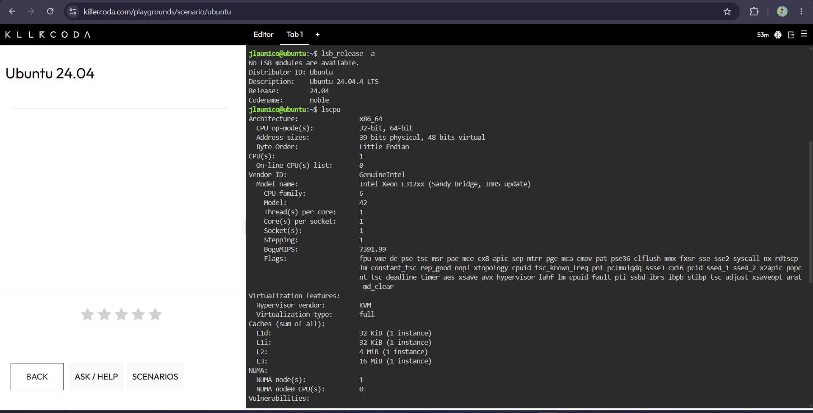
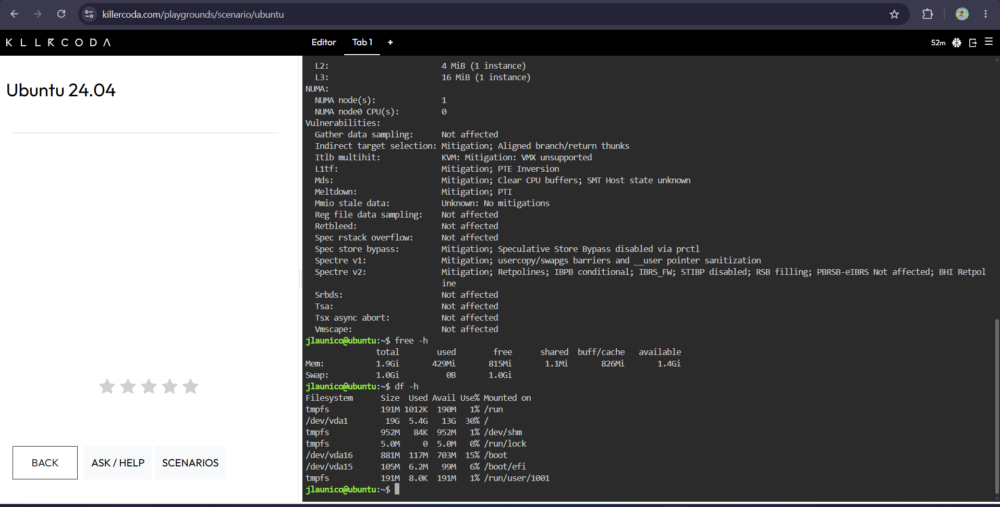

# Laboratory 3: Become a Multi-Cloud Explorer

## Mission Overview
This laboratory activity focused on researching and comparing the three major cloud platforms — Amazon Web Services (AWS), Microsoft Azure, and Google Cloud Platform (GCP). The goal was to understand each platform's core services, strengths, and ideal use cases, and to apply that knowledge by recommending the right cloud provider for different real-world client scenarios.

## Objectives
- Research the overview, infrastructure, console, core services, advantages, and use cases of AWS, Azure, and GCP
- Compare the three platforms side-by-side
- Match equivalent services across all three providers
- Recommend the best-fit cloud platform for different client scenarios
- Investigate a Linux server's specifications and map them to appropriate cloud hosting options
- Reflect on what was learned throughout the mission

## Files in This Folder
- `aws-research.md` — Research on Amazon Web Services
- `azure-research.md` — Research on Microsoft Azure
- `gcp-research.md` — Research on Google Cloud Platform
- `cloud-platform-comparison.md` — Side-by-side comparison, reflection questions, and equivalent services table
- `client-recommendations.md` — Platform recommendations for four client scenarios, plus a decision matrix
- `reflection.md` — Final reflection on the mission
- `screenshots/` — Supporting screenshots for each platform and the Linux investigation

## Checkpoint 7: Linux Investigation

### System Specifications Found

| Category | Details |
|---|---|
| **OS Distribution** | Ubuntu 24.04.4 LTS (Codename: noble) |
| **Architecture** | x86_64 |
| **CPU** | Intel Xeon E312xx (Sandy Bridge, IBRS update), 1 vCPU, 1 core, 1 thread per core |
| **Hypervisor** | KVM (full virtualization) |
| **Total Memory** | 1.9 GiB (429 MiB used, 815 MiB free, 1.4 GiB available) |
| **Swap** | 1.0 GiB (unused) |
| **Root Disk (/)** | 19 GB total, 5.4 GB used, 13 GB available (30% used) |
| **Boot Partition** | 881 MB total, 117 MB used |

### Mapping to Cloud Hosting Services

Given how small and lightweight this server's specs are (1 vCPU, ~2 GB RAM, ~19 GB disk), it closely resembles an entry-level or "burstable" virtual machine tier — the kind typically used for lightweight web servers, small development/testing environments, or low-traffic applications. This server could realistically be hosted using:

- **AWS**: An EC2 `t3.micro` or `t2.micro` instance, which offers similar 1 vCPU / low-memory specs and is part of AWS's free-tier eligible instance types.
- **Azure**: An `B1s` Burstable Virtual Machine, which is Azure's equivalent low-cost, low-resource VM tier meant for workloads that don't need constant full CPU usage.
- **GCP**: An `e2-micro` Compute Engine instance, which offers a similar single vCPU and small memory footprint, and is also part of GCP's always-free tier.

All three options are considered "burstable" or shared-core instance types, meaning they're cost-efficient for small workloads but can briefly use extra CPU performance when needed — a good match for this server's modest specifications.

### Evidence

