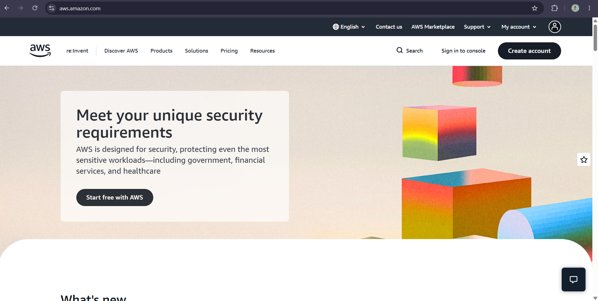

# AWS Research

## Overview
Amazon Web Services (AWS) is the cloud computing platform offered by Amazon, first launched in 2006. It is widely considered the largest and most mature cloud provider in the market, offering over 200 fully featured services from data centers around the globe. AWS is used by startups, enterprises, and government agencies for hosting applications, storing data, running analytics, and much more.

## Infrastructure
AWS infrastructure is organized into **Regions** (separate geographic areas, e.g. US East, Asia Pacific) and **Availability Zones** (isolated data centers within a Region). This design allows businesses to deploy applications closer to their users for lower latency, and to build redundancy so that if one Availability Zone goes down, the application can still run in another.

## Console
The AWS Management Console is the web-based interface used to access and manage all AWS services. It provides a dashboard where users can launch virtual servers, configure storage, set up databases, and monitor usage and billing, all without needing to use the command line (although AWS also provides a CLI and SDKs for programmatic access).

## Core Services

| Service | Category | Description |
|---|---|---|
| **Amazon EC2** (Elastic Compute Cloud) | Compute | Provides resizable virtual servers (instances) for running applications |
| **Amazon S3** (Simple Storage Service) | Storage | Object storage for storing and retrieving any amount of data, such as backups, files, and static websites |
| **Amazon RDS** (Relational Database Service) | Database | Managed relational database service supporting engines like MySQL, PostgreSQL, and SQL Server |
| **AWS Lambda** | Compute (Serverless) | Lets developers run code without provisioning or managing servers, automatically scaling based on demand |

## Advantages
1. **Largest market share and service catalog** – AWS offers the widest range of services, meaning almost any use case can be supported without switching providers.
2. **Mature global infrastructure** – With Regions and Availability Zones across the world, AWS offers strong reliability and low latency for global applications.
3. **Extensive documentation and community support** – Because AWS has been around the longest, it has the largest ecosystem of tutorials, third-party tools, and certified professionals.

## Use Cases
- Hosting scalable web applications and APIs using EC2 and Lambda
- Storing and serving media files or backups using S3
- Running data analytics and machine learning workloads
- Hosting enterprise databases using RDS

## Screenshot

