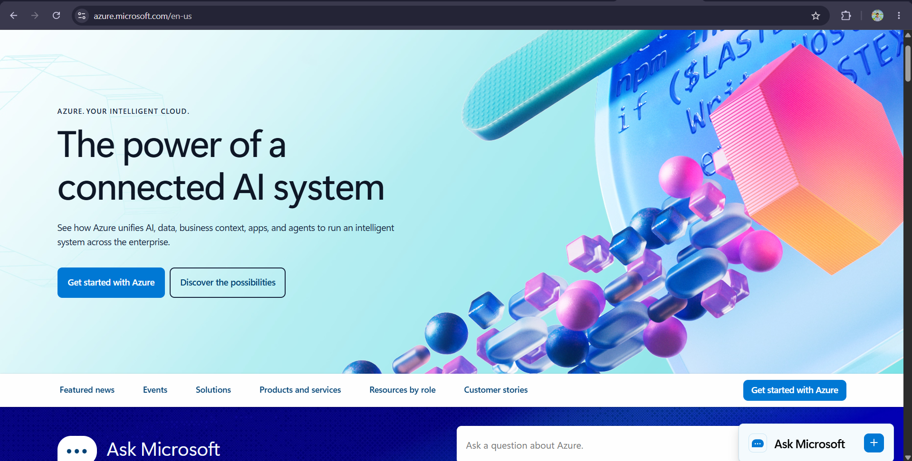

# Azure Research

## Overview
Microsoft Azure is Microsoft's cloud computing platform, launched in 2010. It is one of the top three cloud providers worldwide and is especially popular among enterprises that already rely on Microsoft products like Windows Server, Active Directory, and Office 365, since Azure integrates tightly with these existing tools.

## Infrastructure
Like AWS, Azure organizes its infrastructure into **Regions** and **Availability Zones**. Azure also offers **Region Pairs**, where two regions within the same geography are paired together for disaster recovery purposes, so that if one region experiences an outage, workloads can fail over to its paired region.

## Console
The Azure Portal is the web-based dashboard for managing Azure resources, similar to the AWS Console. It provides a unified view for provisioning virtual machines, managing storage accounts, configuring databases, and tracking cost and usage. Azure also offers the Azure CLI and PowerShell for command-line and scripted management.

## Core Services

| Service | Category | Description |
|---|---|---|
| **Azure Virtual Machines** | Compute | On-demand, scalable virtual servers similar to AWS EC2 |
| **Azure Blob Storage** | Storage | Object storage service for unstructured data such as documents, images, and backups |
| **Azure SQL Database** | Database | Fully managed relational database service built on Microsoft SQL Server |
| **Azure Functions** | Compute (Serverless) | Event-driven, serverless compute service that lets developers run small pieces of code without managing infrastructure |

## Advantages
1. **Deep integration with Microsoft products** – Businesses already using Windows Server, Active Directory, or Microsoft 365 can integrate Azure seamlessly into their existing environment.
2. **Strong hybrid cloud support** – Azure Arc and Azure Stack make it easier for enterprises to manage both on-premises and cloud resources together.
3. **Enterprise-focused compliance and security** – Azure has a strong reputation in regulated industries due to its extensive compliance certifications and enterprise-grade security tools.

## Use Cases
- Hosting enterprise applications that rely on Windows-based infrastructure
- Hybrid cloud deployments that connect on-premises data centers to the cloud
- Running SQL Server-based databases with Azure SQL Database
- Building serverless applications using Azure Functions

## Screenshot

