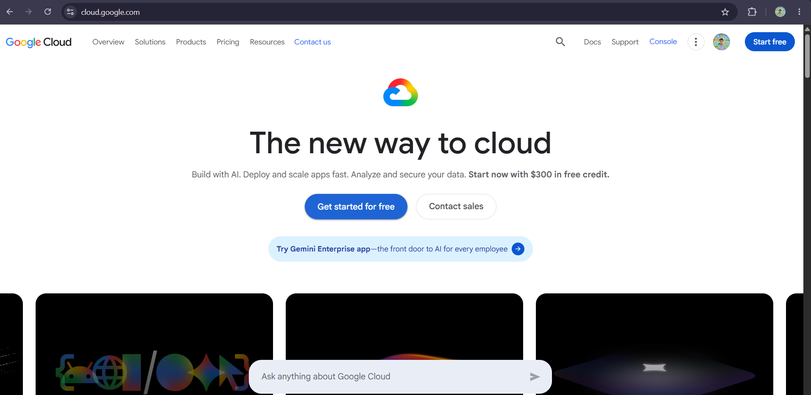

# GCP Research

## Overview
Google Cloud Platform (GCP) is Google's cloud computing platform, launched in 2008. GCP leverages the same global infrastructure that powers Google Search, Gmail, and YouTube. It is well known for its strengths in data analytics, machine learning, and container orchestration, largely because Google itself created foundational technologies like Kubernetes.

## Infrastructure
GCP infrastructure is also organized into **Regions** and **Zones** (GCP's equivalent of Availability Zones). GCP is built on top of Google's own private global fiber network, which connects its data centers directly rather than relying on the public internet between regions, contributing to fast and reliable data transfer.

## Console
The Google Cloud Console is the web-based interface for managing GCP resources. It provides tools for launching virtual machines, managing storage buckets, setting up databases, and monitoring billing and usage. GCP also offers the `gcloud` CLI and client libraries for programmatic access.

## Core Services

| Service | Category | Description |
|---|---|---|
| **Compute Engine** | Compute | Customizable virtual machines for running workloads, similar to AWS EC2 and Azure VMs |
| **Cloud Storage** | Storage | Object storage service for storing unstructured data such as backups, media, and static content |
| **Cloud SQL** | Database | Fully managed relational database service supporting MySQL, PostgreSQL, and SQL Server |
| **Cloud Functions** | Compute (Serverless) | Event-driven, serverless compute service for running lightweight code in response to events |

## Advantages
1. **Strong data analytics and machine learning tools** – Services like BigQuery and Vertex AI make GCP a top choice for data-heavy and AI-driven workloads.
2. **Best-in-class Kubernetes support** – Since Google created Kubernetes, GCP's Google Kubernetes Engine (GKE) is considered one of the most mature managed Kubernetes services available.
3. **Competitive pricing and sustained-use discounts** – GCP automatically applies discounts for workloads that run for extended periods, without requiring upfront commitments.

## Use Cases
- Running big data analytics using BigQuery
- Training and deploying machine learning models with Vertex AI
- Hosting containerized applications using Google Kubernetes Engine (GKE)
- Storing and serving unstructured data using Cloud Storage

## Screenshot

